# 도서 쇼핑몰 웹사이트 📚 SPRING TEAM PROJECT 

💡 `#SPRING`과 `#MySQL`를 이용하여 만든 **도서 쇼핑몰 웹사이트**  
 

## 📌 차례

- [프로젝트 소개](#mag_right-프로젝트-소개)  
- [개발환경 및 기술 세부스택](#wrench-개발환경-및-기술-세부스택)    
- [팀원별 담당 업무](#couple-팀원별-담당-업무) 
- [요구 사항](#speaker-요구-사항) 
- [다이어그램](#bar_chart-다이어그램-(diagram)) 
- [주요 기능](#pager-주요-기능) 
- [외부 API](#newspaper-외부-API) 

 

## :mag_right: 프로젝트 소개 
- 개발기간 : 23/01/05 ~ 23/01/30
- 개발환경 : Windows 10
- 개발도구 : 
- 프로젝트 기획배경 :   도서 대여와 구매를 동시에 할 수 있는 도서 쇼핑몰은 왜 없을까?  
마치 온라인 도서관처럼 온라인에서 도서를 대여하고, 소장하고 싶은 책은 구매까지 가능하다면 지금까지 본 적 없는 혁신적인 도서 쇼핑몰이 되지 않을까? 라는 궁금증에서 
프로젝트의 기획을 시작하였다. 
- 프로젝트 목표 및 성과 : Spring로 JSP와 데이터베이스를 연결하여 추억의 싸이월드 사이트의 여러가지 기능들을 재현한 홈페이지를 제작한다. 
 

## :wrench: 개발환경 및 기술 세부스택

 

## :couple: 팀원별 담당 업무
- 임다혜 : 찜하기 기능 구현, 프론트, 클래스 및 시퀀스 다이어그램, 노션 및 github 관리
- 이다혜 : 도서 리뷰 댓글 기능 구현, 프론트, PPT 제작
- 이재호 : 도서 결제 기능 구현, 스토리보드, 클래스 및 ERD 다이어그램
- 홍진혁 : 장바구니 기능 구현, 유스케이스, 프로젝트 발표 
 

## :speaker: 요구 사항
 
- 관리자 기능

|서비스|기능구현 내용
|:---:|:---:
|공지사항|쇼핑몰 공지사항 작성
|찜하기|모든 사용자의 찜한 목록 조회
|장바구니|모든 사용자의 장바구니 목록 조회
|결제|상품 판매 수량 및 금액 확인
 

- 사용자 기능

|서비스|기능구현 내용
|:---:|:---:
|회원가입|아이디,비밀번호,이름,성별,이메일 등록
|로그인|아이디와 비밀번호 통해 사용자 인증
|게시판|번호, 제목, 작성자, 작성일
|상품명 검색|검색어를 포함한 상품 조회
|찜하기|마음에 드는 상품을 찜하기
|장바구니|장바구니 상품 확인, 상품 수량 변경, 상품 삭제
|결제|수량 및 금액 확인하여 온라인 결제
|문의사항|문의사항 작성, 수정, 삭제
|후기|상품 후기 작성
 

## :bar_chart: 다이어그램 (diagram)
- [x] 유스케이스
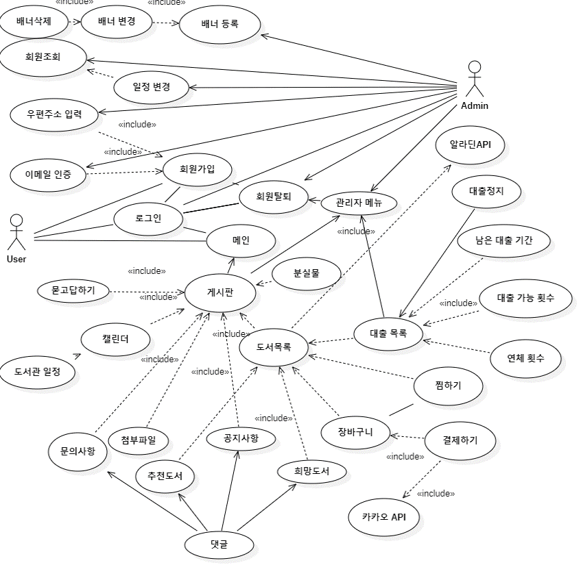

- [x] 클래스 다이어그램
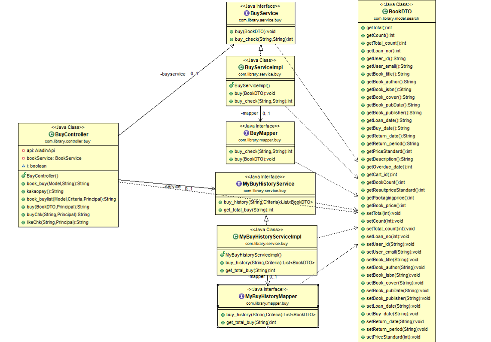
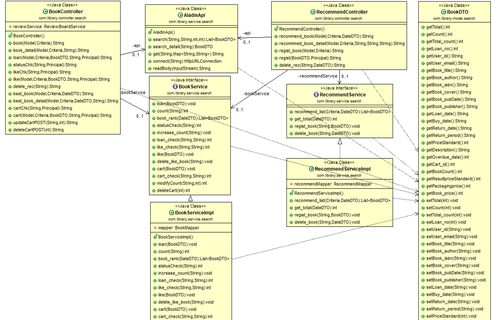
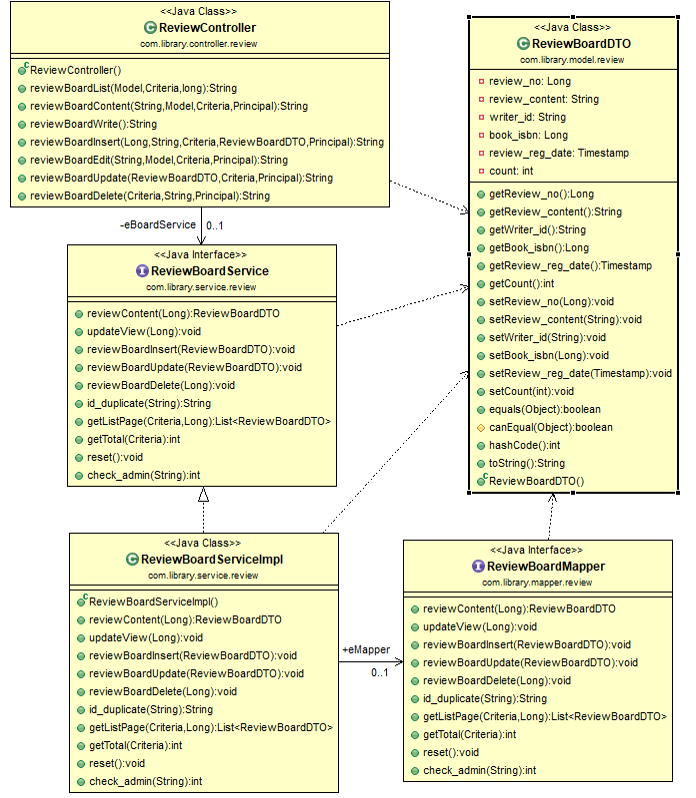
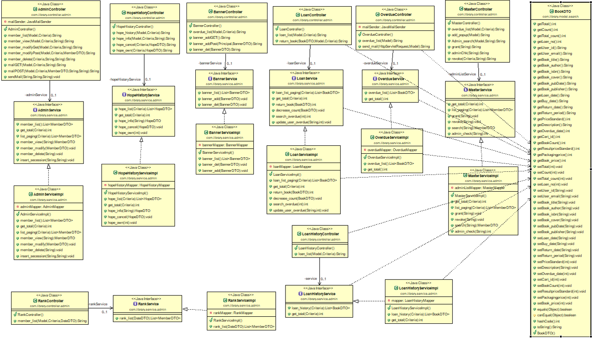

- [x] 시퀀스 다이어그램
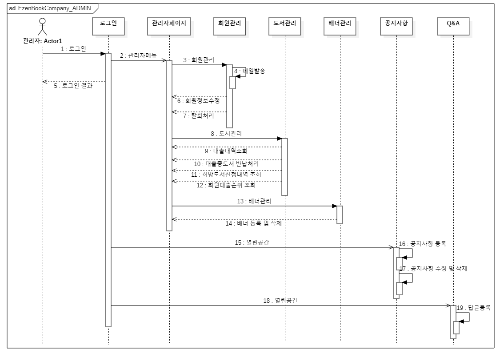
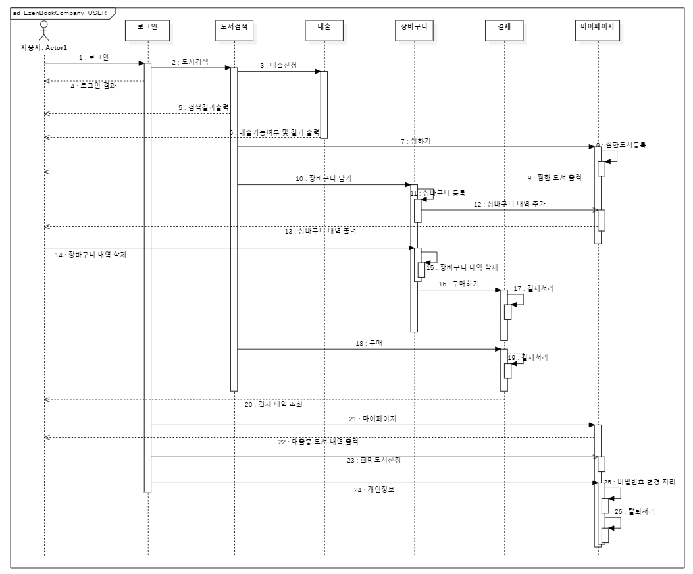

- [x] ERD
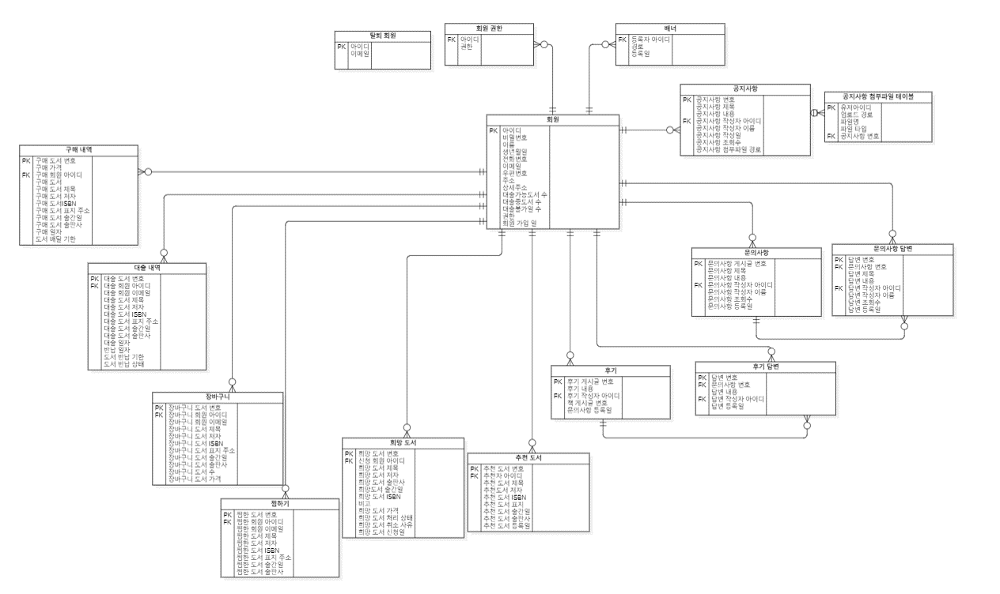
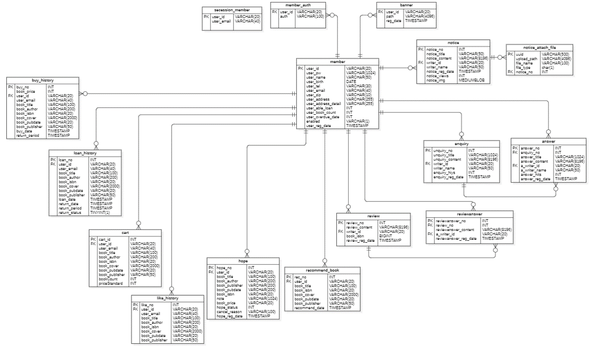
 

## :pager: 주요 기능

### 메인페이지

- 이미지 슬라이더, 그리드 레이아웃

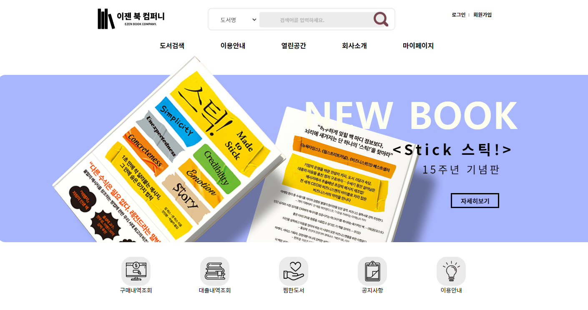
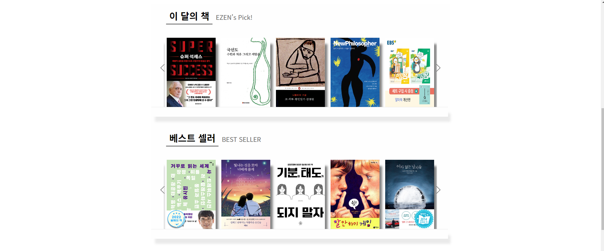
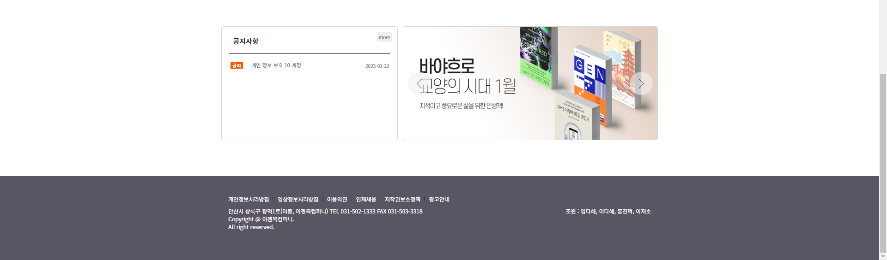

### 로그인 & 회원가입

- 이메일 인증, 로그인 유지, 일반 회원 가입

로그인|회원가입
|---|---|
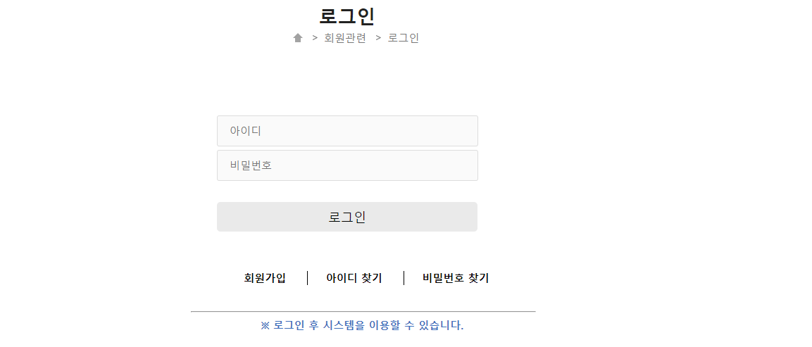|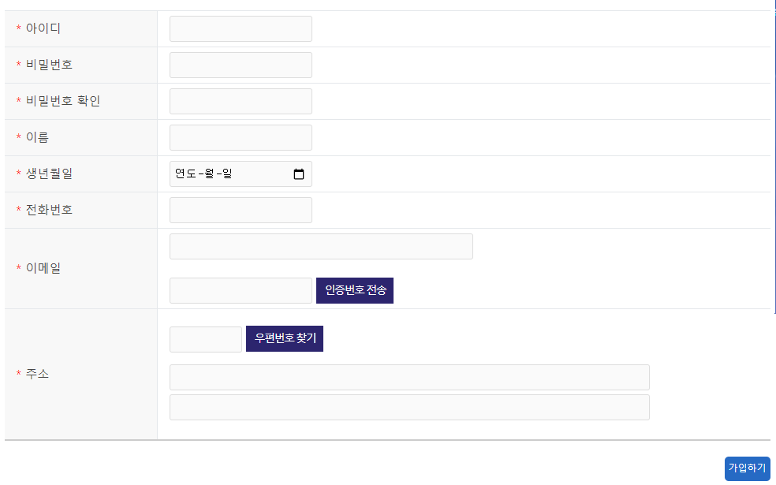

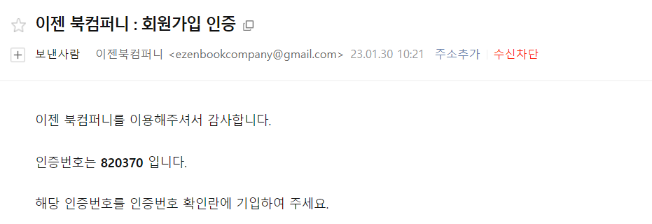

### 도서검색

- 알라딘 API를 이용한 도서 검색

도서검색|도서상세
|---|---|
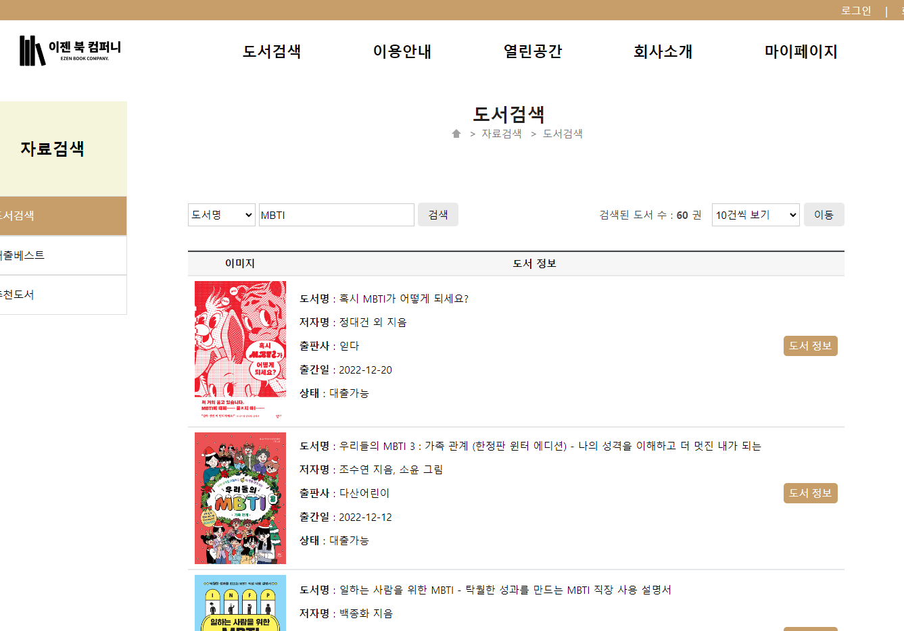|

### 마이페이지

- 대출내역, 회망도서, 열람실, 개인정보

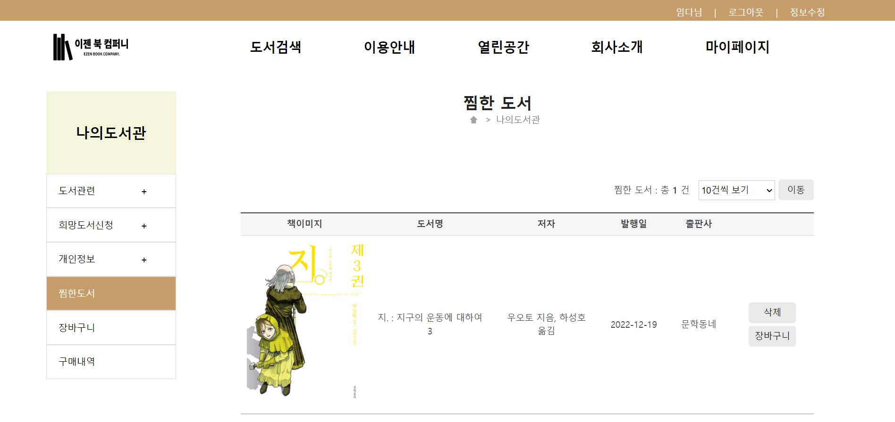

### 관리자 페이지

- 회원관리, 도서 관련, 열람실, 일정, 배너, 관리자

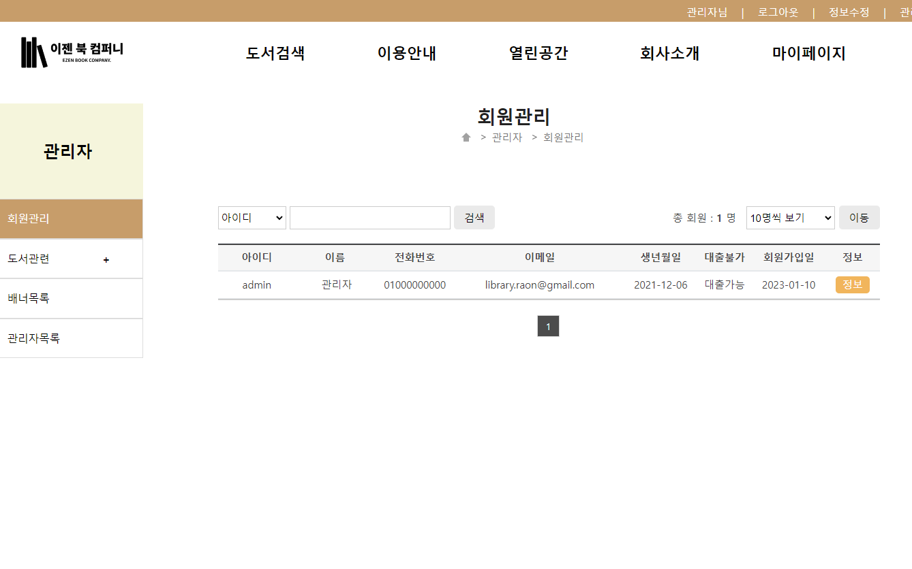

## :newspaper: 외부 API

- 주소검색 - [KaKao 주소 API](https://postcode.map.daum.net/guide)
- 도서검색 - [Aladin API](https://docs.google.com/document/d/1mX-WxuoGs8Hy-QalhHcvuV17n50uGI2Sg_GHofgiePE/edit)
- 카카오 결제 - [Kakao 결제 API](https://developers.kakao.com/docs/latest/ko/kakaopay/common)
